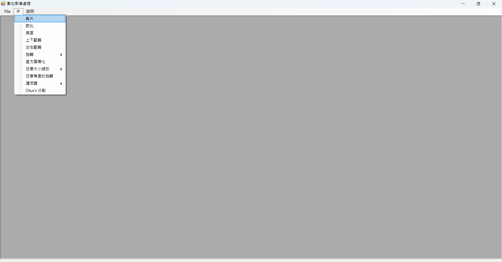

# 數位影像處理應用程式

這是一個使用 C# 開發的 Windows Forms 應用程式，提供多種數位影像處理功能。本應用程式採用 MDI（多文件介面）架構，可同時處理多個影像處理視窗。

## 功能特色

- 支援載入和顯示多種圖片格式，包括 BMP
- 多文件介面，可同時處理多張圖片
- 透過不同表單提供各種影像處理操作：
  - Form1：基本影像操作
  - Form2：額外處理功能
  - Form3：進階處理功能
  - MSForm：主介面處理

## 專案結構

```
├── DIP.sln               # Visual Studio 解決方案檔案
├── DIP/                  # 主要專案目錄
│   ├── DIPSample.cs     # 主應用程式表單
│   ├── Form1.cs         # 第一個處理表單
│   ├── Form2.cs         # 第二個處理表單
│   ├── Form3.cs         # 第三個處理表單
│   ├── MSForm.cs        # MDI 父視窗表單
│   └── Program.cs       # 應用程式進入點
```

## 系統需求

- Windows 作業系統
- .NET Framework
- Visual Studio（用於開發）

## 範例圖片

專案包含多個測試用範例圖片：
- cameraman.bmp
- Lena.bmp
- Lena256_24bits.bmp

## 建置與執行

1. 在 Visual Studio 中開啟 `DIP.sln`
2. 建置解決方案
3. 執行應用程式
4. 編譯後的執行檔可在 `DIP/bin/Debug` 或 `DIP/bin/x86/Debug` 中找到

## 開發說明

本專案是一個具有多個表單的 Windows Forms 應用程式，用於不同的影像處理操作。主要組件包括：

- `DIPSample.cs`：包含主要應用程式邏輯
- `MSForm.cs`：處理 MDI 父視窗功能
- 各種表單類別（`Form1.cs`、`Form2.cs`、`Form3.cs`）：實現不同的影像處理功能

## 輸出檔案

應用程式可以處理多種圖片格式並儲存處理結果。處理後的圖片將儲存在與輸入圖片相同的目錄中（除非另有指定）。

## 程式執行畫面
1. 主畫面


2. 執行結果範例


---

註：本專案是數位影像處理課程（112-2）的實作項目。